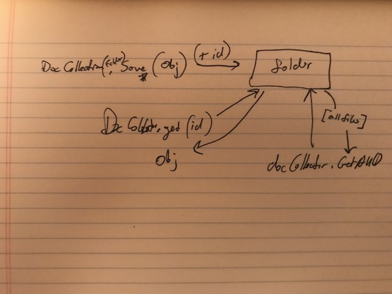

# LAB - Class 03

## Async

### Author: Joseph Klause

### Links and Resources
* [submission PR](https://github.com/josephklause-401-advanced-javascript/lab-class-03/pull/1)
* [travis](https://travis-ci.com/josephklause-401-advanced-javascript/lab-class-03)

#### Running the app
npm run start
    * starts node on index.js
    * will push a new file to destination.txt [folder](destination.txt) and console.log obj
npm run test
    * runs one iteration of test
npm run lint
    * runs linter
npm run test-watch
    * runs test once and re-runs whenever there is a change.

#### UML

